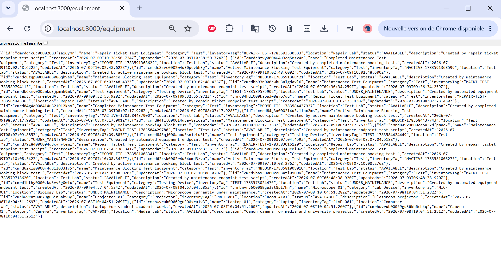
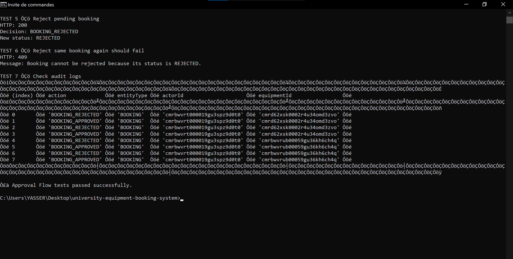
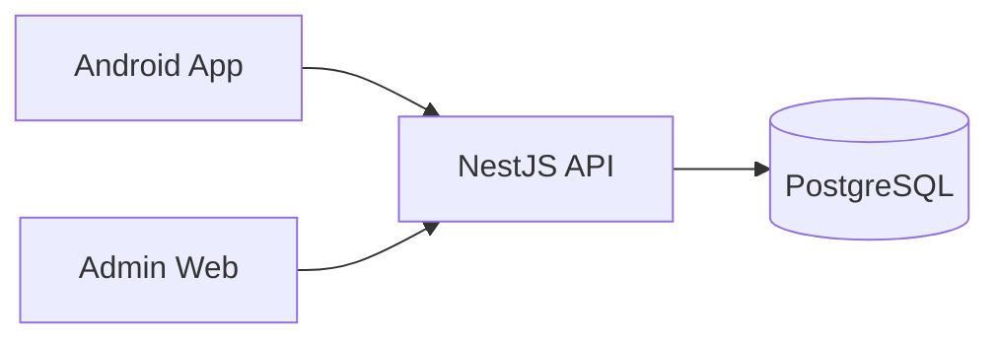

# CPEB University Booking

[](https://github.com/ID9999999999999/cpeb-university-booking/actions/workflows/ci-cd.yml)
[](https://github.com/ID9999999999999/cpeb-university-booking/releases/latest)

**CPEB University Booking** is a complete academic software project for booking and managing university resources. It connects a student/teacher Android application, an administration web portal, a NestJS backend API, and PostgreSQL in one workflow.

> **Simple idea:** a student requests a resource → an administrator approves or rejects it → the decision returns to the student's **My Bookings** view.

## Open the project

| | Link |
|---|---|
| **Android APK** | [Download the latest signed release](https://github.com/ID9999999999999/cpeb-university-booking/releases/latest) |
| **Administration portal** | [Open CPEB Admin Web](https://cpeb-university-booking-admin-web.onrender.com) |
| **Production API** | [Open API](https://cpeb-university-booking-api-v4.onrender.com) |
| **Swagger / OpenAPI** | [Open API documentation](https://cpeb-university-booking-api-v4.onrender.com/docs) |
| **CI/CD** | [GitHub Actions](https://github.com/ID9999999999999/cpeb-university-booking/actions) |

## Project at a glance

| Android App | Admin Web | Backend API | Database |
|---|---|---|---|
| Kotlin + Jetpack Compose | Browser UI + Node server | NestJS + TypeScript | PostgreSQL 16 + Prisma |
| Students & teachers | Admins & lab managers | Business rules & security | Persistent university data |

**Current scope:**

- **70 seeded university resources** across rooms, laboratories, media, sports and parking.
- **5 user roles:** `STUDENT`, `TEACHER`, `TECHNICIAN`, `LAB_MANAGER`, `ADMIN`.
- Booking approval, check-out, return and close lifecycle.
- Equipment inventory management.
- Maintenance scheduling and repair-ticket workflows.
- Authentication, role-based authorization, auditing and production deployment.
- Automated Android, backend, PostgreSQL and Admin Web verification through GitHub Actions.

## What the system looks like

<table>
<tr>
<td width="50%"><strong>Equipment / resources</strong><br></td>
<td width="50%"><strong>Booking approval flow</strong><br></td>
</tr>
</table>

More verification material is available in [`evidence/`](evidence/).

## Main booking workflow

```text
Student / Teacher
       |
       v
    PENDING
    /     \
   v       v
REJECTED  APPROVED
              |
              v
         CHECKED_OUT
              |
              v
           RETURNED
              |
              v
            CLOSED
```

The administration portal completes the approval loop: a request created in the Android app appears as `PENDING`, an authorized administrator or lab manager approves or rejects it, and the decision is returned to the student's **My Bookings** view.

## Architecture



The backend remains authoritative for booking conflicts, permissions, maintenance rules, and lifecycle transitions.

## Key features

### Students and teachers

- Browse and search university resources.
- Check availability and create booking requests.
- Follow booking decisions in **My Bookings**.
- Cancel eligible bookings and complete allowed flows.
- Report equipment problems.

### Administration

- Secure administrator and lab-manager sign-in.
- Review pending bookings and approve/reject requests.
- Search booking history and filter by status.
- Search and manage the equipment inventory.
- Export filtered booking/equipment views to CSV.
- Monitor university-service health.
- Open the Operations Center for maintenance and repair workflows.

### Maintenance and repair

- Schedule maintenance windows.
- Prevent conflicting bookings during maintenance.
- Track repair tickets and technician actions.
- Require diagnosis before appropriate repair resolution.
- Maintain audit history for administrative operations.

## Security and reliability

- bcrypt password hashing and JWT authentication.
- Database-backed role authorization.
- Protected administrative operations.
- Production JWT-secret validation.
- Configurable production CORS.
- Security response headers and restrictive browser policies.
- Booking-collision and maintenance-conflict prevention.
- Structured request IDs, logs and audit events.
- CI checks for backend, PostgreSQL E2E, Android and Admin Web.

## Current project status

The project is **presentation-ready and functionally complete for its academic scope**.

- `main` includes the current **v1.4.0 feature set** described in [`CHANGELOG.md`](CHANGELOG.md).
- The latest public signed Android package is **v1.3.0** in GitHub Releases.
- The latest `main` CI run completed successfully after the presentation/UI polish work.
- API and Admin Web are deployed publicly on Render.

See [`docs/PROJECT_STATUS.md`](docs/PROJECT_STATUS.md) for the concise status sheet and [`docs/PRESENTATION.md`](docs/PRESENTATION.md) for the demo-oriented project explanation.

## Repository structure

```text
apps/
├── admin-web/          Administration portal + Operations Center
├── android/            Android application
└── api/                NestJS backend

docs/                  Architecture, API, database and project documentation
evidence/              Test evidence and screenshots
scripts/               Utility and verification scripts
tests/                 Project verification resources
```

## Continuous integration

Every pull request is validated through GitHub Actions. The pipeline includes:

- Backend dependency/security gate.
- Prisma schema validation and PostgreSQL migrations.
- Backend build, unit tests and deep PostgreSQL E2E tests.
- Deployable backend container build.
- Android unit/API-contract tests, lint and APK build.
- Admin Web JavaScript, security and API-contract checks.

## Local development

<details>
<summary><strong>Backend setup</strong></summary>

Requirements: Node.js 22+, PostgreSQL 16, and npm.

```powershell
cd apps\api
Copy-Item .env.example .env
npm ci
npm run prisma:generate
npm run prisma:migrate
npm run seed:resources
npm run start:dev
```

Configure at least:

```text
DATABASE_URL
JWT_SECRET
SMTP_HOST
SMTP_PORT
SMTP_USER
SMTP_PASSWORD
MAIL_FROM
```

Administrative accounts are provisioned only from explicit environment variables. No public default administrator password is embedded in the active seed flow.

</details>

<details>
<summary><strong>Verification commands</strong></summary>

Backend:

```powershell
cd apps\api
npm run verify
npm run test:e2e -- --runInBand
```

Android:

```powershell
cd apps\android
.\gradlew.bat testDebugUnitTest
.\gradlew.bat lintDebug
.\gradlew.bat assembleDebug
```

Admin Web:

```powershell
cd apps\admin-web
npm run ci
```

</details>

## Production deployment

The repository contains `render.yaml` for the production topology:

- API from `main`.
- Admin Web from `main`.
- PostgreSQL service.
- Production CORS and security configuration.
- Secrets stored as environment variables rather than committed to GitHub.

For a long-lived institutional deployment, the next layer would include managed backups, formal secret rotation, monitoring/alerting, rate limiting, disaster recovery, penetration testing and university operational policies.

## Academic information

**Project:** CPEB University Booking  
**Student:** Yasser Idbouzkri  
**Supervisor:** Nazih Errahel  
**University:** Irkutsk National Research Technical University (INRTU)

## License

All rights reserved.
