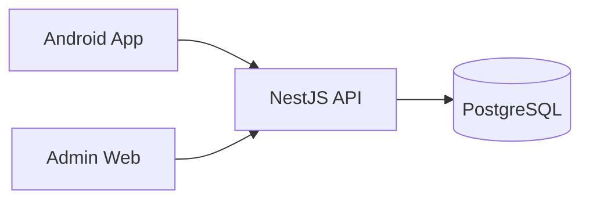

# CPEB University Booking

[](https://github.com/ID9999999999999/cpeb-university-booking/actions/workflows/ci-cd.yml)
[](https://github.com/ID9999999999999/cpeb-university-booking/releases/latest)

**CPEB University Booking** is a complete academic system for booking and managing university resources.

> **Student requests a resource → Admin approves or rejects → The result returns to My Bookings.**

## Quick access

| Open | Link |
|---|---|
| **Android APK** | [Latest signed release](https://github.com/ID9999999999999/cpeb-university-booking/releases/latest) |
| **Admin Web** | [Open administration portal](https://cpeb-university-booking-admin-web.onrender.com) |
| **Production API** | [Open API](https://cpeb-university-booking-api-v4.onrender.com) |
| **Swagger** | [Open API documentation](https://cpeb-university-booking-api-v4.onrender.com/docs) |
| **Project status** | [Current completion sheet](docs/PROJECT_STATUS.md) |
| **Presentation / demo** | [Simple project explanation](docs/PRESENTATION.md) |
| **Evidence** | [Verification material](evidence/) |

## Project in one view



| Layer | Technology | Main purpose |
|---|---|---|
| Android | Kotlin + Jetpack Compose | Student/teacher booking client |
| Admin Web | Browser UI + Node server | Approval, inventory and operations |
| API | NestJS + TypeScript | Rules, authentication and workflows |
| Database | PostgreSQL 16 + Prisma | Persistent university data |

## What is already working

- **70 seeded university resources** across rooms, laboratories, media, sports and parking.
- **5 user roles:** `STUDENT`, `TEACHER`, `TECHNICIAN`, `LAB_MANAGER`, `ADMIN`.
- Registration, verification, login and JWT sessions.
- Resource search, filtering, details and availability.
- Booking request, approval/rejection, check-out, return and close lifecycle.
- Booking collision prevention.
- Admin booking history and equipment inventory.
- Maintenance scheduling and booking blocking.
- Repair-ticket and technician workflows.
- Audit logging and protected administrative operations.
- Public API/Admin deployment and automated CI verification.

## Visual evidence

<table>
<tr>
<td width="50%"><strong>Equipment / resources</strong><br></td>
<td width="50%"><strong>Booking approval workflow</strong><br></td>
</tr>
</table>

More proof is organized in [`evidence/`](evidence/).

## Booking workflow

```text
Student / Teacher
       |
       v
    PENDING
    /     \
   v       v
REJECTED  APPROVED
              |
              v
         CHECKED_OUT
              |
              v
           RETURNED
              |
              v
            CLOSED
```

The backend is authoritative for permissions, conflicts, maintenance rules and lifecycle transitions.

## Project status

The academic core is **functionally complete and presentation-ready**.

- `main` contains the current **v1.4.0 feature set** plus repository/presentation cleanup.
- The latest signed public Android package currently published in Releases is **v1.3.0**.
- The verified presentation/UI code baseline passed the complete CPEB CI-CD workflow.
- API and Admin Web are deployed publicly on Render.

See [`docs/PROJECT_STATUS.md`](docs/PROJECT_STATUS.md) for the canonical current status. Future improvements are separated into [`docs/roadmap/README.md`](docs/roadmap/README.md).

## Repository structure

```text
apps/
├── android/            Android booking application
├── admin-web/          Administration portal + Operations Center
└── api/                NestJS backend

docs/                  Current documentation and technical reference
evidence/              Screenshots, tests, logs and latest audit evidence
scripts/               Development/verification utilities
tests/                 Project verification resources
```

## Documentation

Start with [`docs/README.md`](docs/README.md).

- [`docs/PRESENTATION.md`](docs/PRESENTATION.md) — simple explanation and demo flow.
- [`docs/PROJECT_STATUS.md`](docs/PROJECT_STATUS.md) — canonical status sheet.
- [`docs/architecture/`](docs/architecture/) — architecture and repository structure.
- [`docs/api/`](docs/api/) — API notes and Postman resources.
- [`docs/database/`](docs/database/) — database notes.
- [`docs/roadmap/`](docs/roadmap/) — future improvements.

<details>
<summary><strong>Local development and verification</strong></summary>

### Backend

```powershell
cd apps\api
Copy-Item .env.example .env
npm ci
npm run prisma:generate
npm run prisma:migrate
npm run seed:resources
npm run start:dev
```

### Verification

```powershell
# Backend
cd apps\api
npm run verify
npm run test:e2e -- --runInBand

# Android
cd ..\android
.\gradlew.bat testDebugUnitTest
.\gradlew.bat lintDebug
.\gradlew.bat assembleDebug

# Admin Web
cd ..\admin-web
npm run ci
```

</details>

## Security and deployment

The project includes bcrypt password hashing, JWT authentication, role-based authorization, validation, protected management operations, security headers, production CORS configuration, audit events and CI security checks.

`render.yaml` describes the deployed API/Admin/PostgreSQL topology. Secrets remain environment variables and are not committed to GitHub.

## Academic information

**Project:** CPEB University Booking  
**Student:** Yasser Idbouzkri  
**Supervisor:** Nazih Errahel  
**University:** Irkutsk National Research Technical University (INRTU)

## License

All rights reserved.
